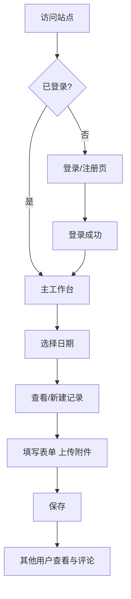

# 考务科每日工作记录平台 · 产品需求文档 (PRD)

## 1. Product Overview

考务科每日工作记录与总结在线平台,用于考务科工作人员记录每日工作内容、共享日程并互相点评评论。
- 解决纸质记录难以检索、信息孤岛的问题;所有用户共享同一份日历,促进信息透明与协作。
- 目标用户:考务科全体工作人员(通过工号+姓名注册登录)。

## 2. Core Features

### 2.1 User Roles

| Role | Registration Method | Core Permissions |
|------|---------------------|------------------|
| 普通用户 | 工号 + 姓名注册 | 登录、查看所有记录、新建/编辑自己的记录、上传附件、对任何记录发表评论 |

### 2.2 Feature Module

1. **登录/注册页**:工号、姓名表单,注册后直接登录。
2. **主工作台**:左侧为共享月历,右侧为当日记录列表与新建/编辑表单。
3. **记录详情**:标题、内容、附件、参与人、北京时间(年月日时分)。
4. **点评评论**:任意已登录用户可对任意记录添加评论。
5. **日期切换**:点击日历中任意日期查看/编辑该日记录。

### 2.3 Page Details

| Page Name | Module Name | Feature description |
|-----------|-------------|---------------------|
| 登录/注册 | Auth Panel | 工号唯一约束,校验非空;支持切换登录与注册 |
| 主工作台 | 日历面板 | 月视图,高亮当前选中日期;有记录的日期显示小圆点 |
| 主工作台 | 记录列表 | 按时间倒序列出当日所有记录,显示标题、创建人、时间 |
| 主工作台 | 记录表单 | 标题、内容(textarea)、附件上传(多文件)、参与人(多人,逗号分隔)、日期时间 (默认当前北京时间) |
| 主工作台 | 评论区 | 每条记录下方显示评论,输入框可追加新评论 |
| 主工作台 | 顶部栏 | 当前登录用户姓名、退出登录按钮 |

## 3. Core Process

用户访问 → 未登录跳转登录页 → 登录/注册成功 → 进入主工作台 → 默认选中今日 → 查看/新建/编辑记录 → 上传附件 → 提交保存 → 其他用户登录后可见并评论。

## 4. User Interface Design

### 4.1 Design Style

- 主色:深蓝 `#1e3a8a`(考务稳重感),副色:琥珀金 `#d97706`(高亮与强调)。
- 按钮:圆角中等,悬停时轻微阴影与亮度提升;次按钮为描边样式。
- 字体:中文正文使用 "PingFang SC" / "Microsoft YaHei",英文数字使用 "SF Mono" 风格等宽字体用于时间显示。
- 布局:左右两栏,左侧固定宽度日历,右侧弹性内容区,卡片式记录块。
- 图标:使用 `lucide-react` 线性图标。

### 4.2 Page Design Overview

| Page Name | Module Name | UI Elements |
|-----------|-------------|-------------|
| 登录页 | Auth Panel | 居中卡片,顶部品牌标题与副标,工号/姓名输入,登录/注册切换 |
| 主工作台 | 顶部栏 | 左侧 Logo 与标题,右侧用户姓名与退出按钮 |
| 主工作台 | 日历面板 | 月历网格,周几表头,当日高亮,有记录日显示小圆点 |
| 主工作台 | 记录列表 | 卡片列表,悬浮缩放与阴影,点击展开详情与评论 |
| 主工作台 | 表单区 | 分组输入框,附件上传拖拽区,提交按钮底部对齐 |

### 4.3 Responsiveness

- 桌面端(>= 1024px):左 380px 日历,右弹性内容。
- 平板/移动端:日历折叠为顶部横向条,内容垂直堆叠;表单输入框自适应全宽。

---

## 5. 数据字段约束

- 日期时间统一使用**北京时间 (UTC+8)**,服务端存储为 ISO 字符串(含时区偏移)。
- 附件:单个文件 <= 10MB,支持常见办公与图片格式(doc/docx/xls/xlsx/pdf/png/jpg 等)。
- 工号全局唯一,仅允许字母与数字。
