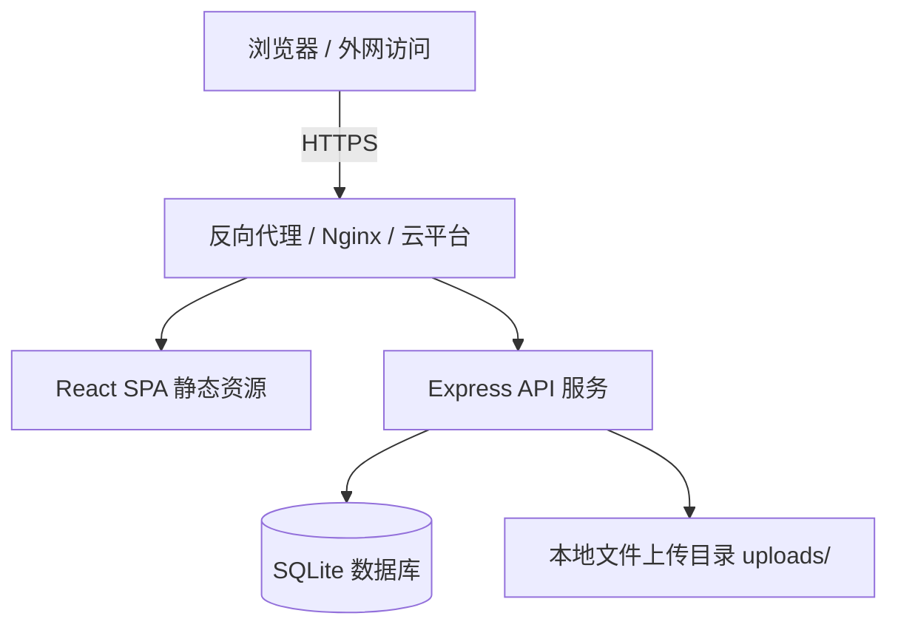
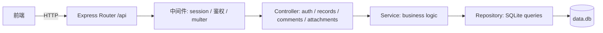
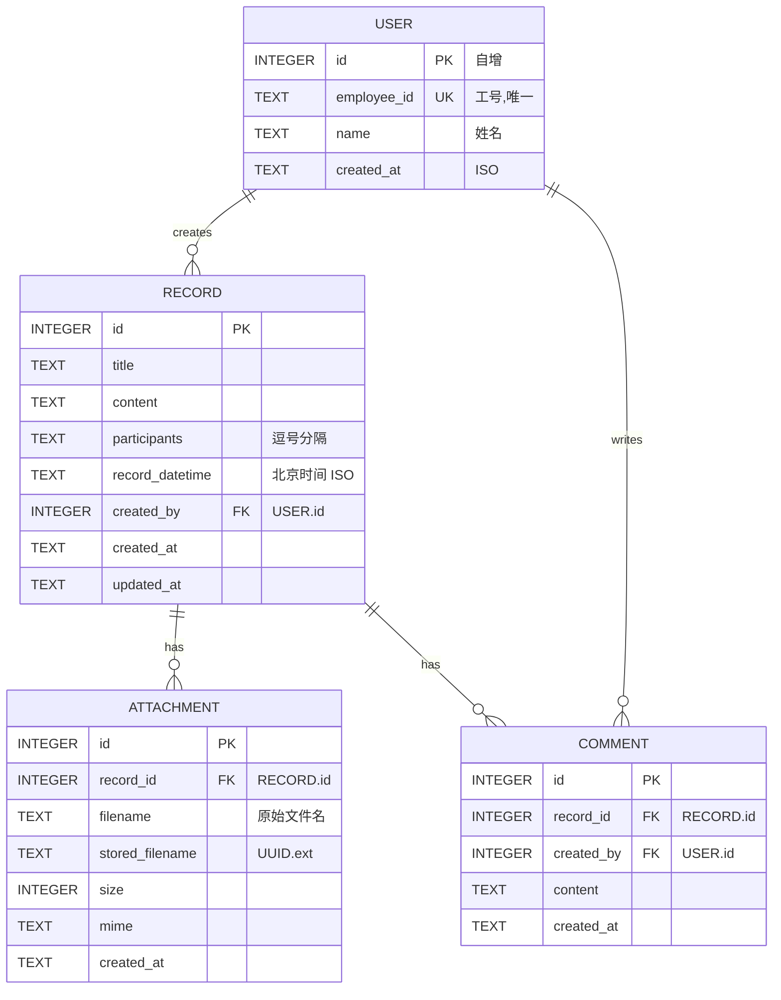

# 考务科每日工作记录平台 · 技术架构文档

## 1. Architecture Design



采用前后端分离 + 单体 Express 服务的架构。后端既提供静态资源,也提供 JSON API。部署到外网服务器(任何支持 Node.js 的 Linux 主机 / 云平台均可)。

## 2. Technology Description

- **Frontend**: React 18 + TypeScript + Vite + Tailwind CSS 3 + zustand + react-router-dom + lucide-react
- **Backend**: Express 4 + TypeScript + better-sqlite3 + multer + express-session
- **Database**: SQLite(单文件 `data.db`,便于部署与迁移;未来可无痛切换到 MySQL/PostgreSQL)
- **认证**: 基于 Cookie 的 express-session + 内存存储(生产可替换为 Redis)
- **时间处理**: 统一使用 `Asia/Shanghai` (UTC+8) 时区
- **初始化工具**: vite-init (react-express-ts 模板)

## 3. Route Definitions

| Route (Frontend) | Purpose |
|------------------|---------|
| `/login` | 登录 / 注册页 |
| `/`      | 主工作台(默认选中今日) |

## 4. API Definitions

所有 API 挂在 `/api` 前缀下,未登录返回 401。

### TypeScript Types

```ts
interface User {
  id: number;
  employee_id: string;  // 工号,唯一
  name: string;
  created_at: string;
}

interface Attachment {
  id: number;
  record_id: number;
  filename: string;       // 原始文件名
  stored_filename: string; // 存储在服务器的文件名
  size: number;
  mime: string;
  created_at: string;
}

interface Record {
  id: number;
  title: string;
  content: string;
  participants: string;   // 以 "," 分隔的姓名列表
  record_datetime: string;// 北京时间 ISO
  created_by: number;
  creator_name: string;
  creator_employee_id: string;
  created_at: string;
  updated_at: string;
  attachments: Attachment[];
  comment_count: number;
}

interface Comment {
  id: number;
  record_id: number;
  content: string;
  created_by: number;
  creator_name: string;
  creator_employee_id: string;
  created_at: string;
}
```

### Endpoints

| Method | Path | Description | Auth Required |
|--------|------|-------------|---------------|
| POST   | `/api/auth/register` | `{ employee_id, name }` 注册并登录 | 否 |
| POST   | `/api/auth/login`    | `{ employee_id, name }` 登录 | 否 |
| POST   | `/api/auth/logout`   | 退出登录 | 是 |
| GET    | `/api/auth/me`       | 返回当前用户 | 是 |
| GET    | `/api/records?date=YYYY-MM-DD` | 取指定日期的记录列表(含附件数量、评论数) | 是 |
| GET    | `/api/records/:id`   | 取单条记录详情(含附件与评论) | 是 |
| POST   | `/api/records`       | 新建记录(支持 multipart/form-data 文件上传) | 是 |
| PATCH  | `/api/records/:id`   | 更新自己的记录 | 是 |
| DELETE | `/api/records/:id`   | 删除自己的记录 | 是 |
| POST   | `/api/records/:id/comments` | 对记录发表评论 `{ content }` | 是 |
| GET    | `/api/attachments/:id/:stored_filename` | 下载附件 | 是 |
| GET    | `/api/calendar/markers?month=YYYY-MM` | 返回指定月份中哪些天有记录 | 是 |

## 5. Server Architecture Diagram



## 6. Data Model

### 6.1 ER Diagram



### 6.2 DDL (SQLite)

```sql
CREATE TABLE IF NOT EXISTS users (
  id INTEGER PRIMARY KEY AUTOINCREMENT,
  employee_id TEXT NOT NULL UNIQUE,
  name TEXT NOT NULL,
  created_at TEXT NOT NULL DEFAULT (datetime('now','localtime'))
);

CREATE TABLE IF NOT EXISTS records (
  id INTEGER PRIMARY KEY AUTOINCREMENT,
  title TEXT NOT NULL,
  content TEXT NOT NULL,
  participants TEXT,
  record_datetime TEXT NOT NULL,
  created_by INTEGER NOT NULL,
  created_at TEXT NOT NULL DEFAULT (datetime('now','localtime')),
  updated_at TEXT NOT NULL DEFAULT (datetime('now','localtime'))
);
CREATE INDEX idx_records_datetime ON records(record_datetime);
CREATE INDEX idx_records_created_by ON records(created_by);

CREATE TABLE IF NOT EXISTS attachments (
  id INTEGER PRIMARY KEY AUTOINCREMENT,
  record_id INTEGER NOT NULL,
  filename TEXT NOT NULL,
  stored_filename TEXT NOT NULL,
  size INTEGER NOT NULL,
  mime TEXT,
  created_at TEXT NOT NULL DEFAULT (datetime('now','localtime'))
);
CREATE INDEX idx_attachments_record ON attachments(record_id);

CREATE TABLE IF NOT EXISTS comments (
  id INTEGER PRIMARY KEY AUTOINCREMENT,
  record_id INTEGER NOT NULL,
  created_by INTEGER NOT NULL,
  content TEXT NOT NULL,
  created_at TEXT NOT NULL DEFAULT (datetime('now','localtime'))
);
CREATE INDEX idx_comments_record ON comments(record_id);
```

## 7. 部署方式

- 单体 Node.js 服务,使用 `node api/dist/server.js` 启动。
- 构建脚本:
  - `npm run build` → 同时构建前端和后端
  - `npm start` → 以生产模式启动 Express
- 环境变量(可选):
  - `PORT`(默认 3000)
  - `SESSION_SECRET`(生产环境必须设置)
  - `TZ=Asia/Shanghai`(确保进程时区)
- 外网部署:推荐 Docker + 反向代理(Nginx / Caddy), 或直接部署到支持 Node 的 VPS。
